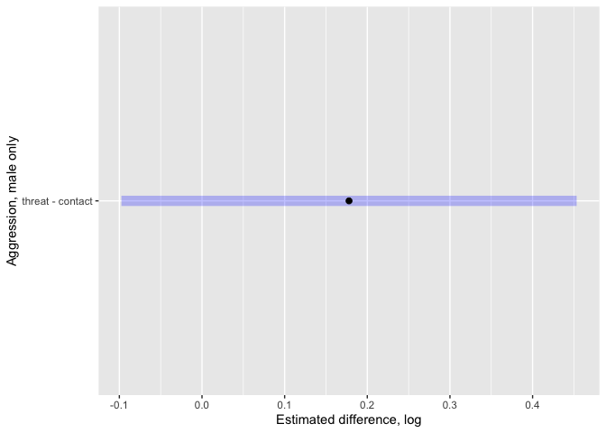

## Load libraries


```r
library(tidyverse)
```

```
## ── Attaching packages ─────────────────────────────────────── tidyverse 1.3.1 ──
```

```
## ✓ ggplot2 3.3.5     ✓ purrr   0.3.4
## ✓ tibble  3.1.6     ✓ dplyr   1.0.8
## ✓ tidyr   1.2.0     ✓ stringr 1.4.0
## ✓ readr   2.1.1     ✓ forcats 0.5.1
```

```
## ── Conflicts ────────────────────────────────────────── tidyverse_conflicts() ──
## x dplyr::filter() masks stats::filter()
## x dplyr::lag()    masks stats::lag()
```

```r
library(ggbeeswarm)
library(ggdist)
library(broom)
library(distributional)
library(forcats)
library(glmmTMB)
library(emmeans)
library(DHARMa)
```

```
## This is DHARMa 0.4.4. For overview type '?DHARMa'. For recent changes, type news(package = 'DHARMa')
```

```r
library(car)
```

```
## Loading required package: carData
```

```
## 
## Attaching package: 'car'
```

```
## The following object is masked from 'package:dplyr':
## 
##     recode
```

```
## The following object is masked from 'package:purrr':
## 
##     some
```

```r
library(lme4) # for bootmer
```

```
## Loading required package: Matrix
```

```
## 
## Attaching package: 'Matrix'
```

```
## The following objects are masked from 'package:tidyr':
## 
##     expand, pack, unpack
```


## Data input and checks

First the data for the "male only" experiment


```r
aggression_male_only <- read.csv("../data/CB_RD_M.csv", 
                                 stringsAsFactors = F)

str(aggression_male_only)
```

```
## 'data.frame':	361 obs. of  13 variables:
##  $ ObsID                     : chr  "D4-002" "D4-098" "D6-133" "D5-033" ...
##  $ Observer                  : chr  "J" "J" "J" "J" ...
##  $ Obs_code                  : chr  "D4-002-J" "D4-098-J" "D6-133-J" "D5-033-J" ...
##  $ DGRP                      : int  26 26 26 26 26 26 26 26 26 26 ...
##  $ lunge_count               : int  2 2 0 1 1 1 0 0 1 0 ...
##  $ hold_count                : int  0 0 0 0 0 0 0 0 0 0 ...
##  $ aggr_dur_1male            : num  8.75 26.51 17.26 11.76 11.24 ...
##  $ total_wing_threat_dur     : num  8.25 1.25 0 2.25 1.75 ...
##  $ total_boxing_duration     : num  0 0.498 0.5 0.751 2.504 ...
##  $ total_tussling_duration   : num  0 0 0 0 0 0 0 0 0 0 ...
##  $ ceiling_dur               : num  42.5 0 0 0 0 0 0 0 0 0 ...
##  $ Threat_s_per_m            : num  0.825 0.125 0 0.225 0.175 ...
##  $ PhysicalAggression_s_per_m: num  0.875 2.7 1.776 1.251 1.374 ...
```


### Data munging

create day variable (day experiment run), factors.

```r
aggression_male_only$day <- str_split(aggression_male_only$ObsID , "-", simplify = T)[,1]

str(aggression_male_only)
```

```
## 'data.frame':	361 obs. of  14 variables:
##  $ ObsID                     : chr  "D4-002" "D4-098" "D6-133" "D5-033" ...
##  $ Observer                  : chr  "J" "J" "J" "J" ...
##  $ Obs_code                  : chr  "D4-002-J" "D4-098-J" "D6-133-J" "D5-033-J" ...
##  $ DGRP                      : int  26 26 26 26 26 26 26 26 26 26 ...
##  $ lunge_count               : int  2 2 0 1 1 1 0 0 1 0 ...
##  $ hold_count                : int  0 0 0 0 0 0 0 0 0 0 ...
##  $ aggr_dur_1male            : num  8.75 26.51 17.26 11.76 11.24 ...
##  $ total_wing_threat_dur     : num  8.25 1.25 0 2.25 1.75 ...
##  $ total_boxing_duration     : num  0 0.498 0.5 0.751 2.504 ...
##  $ total_tussling_duration   : num  0 0 0 0 0 0 0 0 0 0 ...
##  $ ceiling_dur               : num  42.5 0 0 0 0 0 0 0 0 0 ...
##  $ Threat_s_per_m            : num  0.825 0.125 0 0.225 0.175 ...
##  $ PhysicalAggression_s_per_m: num  0.875 2.7 1.776 1.251 1.374 ...
##  $ day                       : chr  "D4" "D4" "D6" "D5" ...
```

```r
aggression_male_only[,c(1:4, 14)] <- lapply(aggression_male_only[,c(1:4, 14)], FUN = as.factor)
```


rename some variables to make model clearer to read.


```r
names(aggression_male_only)
```

```
##  [1] "ObsID"                      "Observer"                  
##  [3] "Obs_code"                   "DGRP"                      
##  [5] "lunge_count"                "hold_count"                
##  [7] "aggr_dur_1male"             "total_wing_threat_dur"     
##  [9] "total_boxing_duration"      "total_tussling_duration"   
## [11] "ceiling_dur"                "Threat_s_per_m"            
## [13] "PhysicalAggression_s_per_m" "day"
```

```r
names(aggression_male_only)[12:13] <- c("threat", "contact")
```


```r
aggression_male_only <- select(aggression_male_only, ObsID, Observer, Obs_code, 
                               day, DGRP, threat, contact)

aggression_male_only <- gather(aggression_male_only, category, duration, threat:contact, 
                               factor_key = TRUE)

str(aggression_male_only)
```

```
## 'data.frame':	722 obs. of  7 variables:
##  $ ObsID   : Factor w/ 358 levels "D1-001","D1-002",..: 149 195 351 230 42 327 146 10 277 171 ...
##  $ Observer: Factor w/ 2 levels "A","J": 2 2 2 2 2 2 2 2 2 1 ...
##  $ Obs_code: Factor w/ 361 levels "D1-001-J","D1-002-J",..: 149 195 354 233 42 330 146 10 280 171 ...
##  $ day     : Factor w/ 5 levels "D1","D3","D4",..: 3 3 5 4 1 5 2 1 4 3 ...
##  $ DGRP    : Factor w/ 24 levels "26","45","57",..: 1 1 1 1 1 1 1 1 1 1 ...
##  $ category: Factor w/ 2 levels "threat","contact": 1 1 1 1 1 1 1 1 1 1 ...
##  $ duration: num  0.825 0.125 0 0.225 0.175 ...
```


### raw data plots - male only


```r
ggplot(aggression_male_only, aes(duration, fill = category)) +
  geom_histogram(alpha = 0.5, binwidth = 4)
```

<!-- -->

```r
ggplot(aggression_male_only, aes(y = duration, x = category, col = day)) + 
  geom_quasirandom(alpha = 0.25)
```

<!-- -->

```r
ggplot(aggression_male_only, aes(y = duration, x = day)) + 
  geom_quasirandom(alpha = 0.25) + 
  facet_wrap(vars(category, Observer))
```

<!-- -->

```r
ggplot(aggression_male_only, aes(y = duration, x = DGRP)) + 
  geom_quasirandom(alpha = 0.25) + 
  facet_wrap(vars(category))
```

<!-- -->

```r
length(aggression_male_only$duration[aggression_male_only$duration == 0])
```

```
## [1] 55
```

```r
length(aggression_male_only$duration[aggression_male_only$duration == 0])/length(aggression_male_only$duration) # about 7% of trials with no aggression
```

```
## [1] 0.07618
```


### Full model - male only

If you are only interested in the estimates for the fixed effects, set `REML = F`.

Fixed effects presented in the paper are from ML, but all estimates related to variance components are REML. Since the main focus is on those, default to `REML = T`.

*note for myself:* BB and I had an interesting conversation on whether REML actually improves the estimates of variance components for generalized linear models. We did find a few papers (mostly for logistic mixed models and poisson and nb) suggesting it does.

*Another note for myself:* As we would want, for a Tweedie distribution, glmmTMB constrains the power parameter to be $1<x<2$ so it is continuous and "Gamma like" but allowing some zeroes. However, currently glmmTMB does not have an easy way to extract the estimated power parameter (since it is fairly unique to the Tweedie).


```r
mod1_tmb <- glmmTMB(duration ~ 1 + category + (0 + category|DGRP) + (1|day) + (1|Observer) + (0 + category | Obs_code), 
                    data = aggression_male_only,
                    REML = T,
                    family = tweedie(link = "log"))


#should I do this instead for glmmTMB?
# Discussed with Ben Bolker. He also thought my original (above) model specification made the most sense.
# mod1_tmb_alt <- glmmTMB(duration ~ 1 + category + (0 + category|DGRP) + (1|day) + (1|Observer), 
#                     dispformula = ~ 0 + category,    
#                     data = aggression_male_only,
#                     REML = T,
#                     family = tweedie(link = "log"))
summary(mod1_tmb)
```

```
##  Family: tweedie  ( log )
## Formula:          
## duration ~ 1 + category + (0 + category | DGRP) + (1 | day) +  
##     (1 | Observer) + (0 + category | Obs_code)
## Data: aggression_male_only
## 
##      AIC      BIC   logLik deviance df.resid 
##     3115     3170    -1545     3091      712 
## 
## Random effects:
## 
## Conditional model:
##  Groups   Name            Variance Std.Dev. Corr 
##  DGRP     categorythreat  0.6499   0.806         
##           categorycontact 0.2827   0.532    0.73 
##  day      (Intercept)     0.1239   0.352         
##  Observer (Intercept)     0.0404   0.201         
##  Obs_code categorythreat  1.4217   1.192         
##           categorycontact 0.6434   0.802    0.45 
## Number of obs: 722, groups:  DGRP, 24; day, 5; Observer, 2; Obs_code, 361
## 
## Dispersion parameter for tweedie family (): 0.543 
## 
## Conditional model:
##                 Estimate Std. Error z value Pr(>|z|)
## (Intercept)        0.546      0.284    1.93    0.054
## categorycontact   -0.178      0.140   -1.27    0.205
```

```r
# Q for BB, how to extract power used for tweedie dist?
# answer from BB... not currently available in a sensible way.

plot(simulateResiduals(mod1_tmb))
```

<!-- -->

```r
plotQQunif(simulateResiduals(mod1_tmb))
```

<!-- -->

```r
testZeroInflation(simulateResiduals(mod1_tmb))
```

<!-- -->

```
## 
## 	DHARMa zero-inflation test via comparison to expected zeros with
## 	simulation under H0 = fitted model
## 
## data:  simulationOutput
## ratioObsSim = 0.99, p-value = 1
## alternative hypothesis: two.sided
```

```r
confint(mod1_tmb) # also check profile in addition to wald approx
```

```
##                                                2.5 %  97.5 % Estimate
## (Intercept)                                 -0.00975 1.10269   0.5465
## categorycontact                             -0.45283 0.09705  -0.1779
## Std.Dev.categorythreat|DGRP                  0.56608 1.14813   0.8062
## Std.Dev.categorycontact|DGRP                 0.37034 0.76341   0.5317
## Cor.categorycontact.categorythreat|DGRP      0.23204 0.88377   0.7286
## Std.Dev.(Intercept)|day                      0.16294 0.76063   0.3521
## Std.Dev.(Intercept)|Observer                 0.03819 1.05736   0.2009
## Std.Dev.categorythreat|Obs_code              1.02128 1.39209   1.1924
## Std.Dev.categorycontact|Obs_code             0.67766 0.94943   0.8021
## Cor.categorycontact.categorythreat|Obs_code  0.27951 0.58213   0.4497
```

```r
  # 95% CIs for rG from 0.25 to 0.88, with the point estimate at 0.74

mod1_fixef <-  summary(emmeans(mod1_tmb, ~ category), 
                       type = "response")

mod1_fixef_link <- summary(emmeans(mod1_tmb, ~ category), 
                            type = "link")

pairs(emmeans(mod1_tmb, ~ category), type = "response")
```

```
##  contrast         ratio    SE  df null t.ratio p.value
##  threat / contact  1.19 0.168 712    1   1.268  0.2052
## 
## Tests are performed on the log scale
```

```r
pairs(emmeans(mod1_tmb, ~ category))
```

```
##  contrast         estimate   SE  df t.ratio p.value
##  threat - contact    0.178 0.14 712   1.268  0.2052
## 
## Results are given on the log (not the response) scale.
```

```r
# checking consistency in CIs via profiling
# not working, submit issue to glmmTMB github for Ben Bolker. It works for standard examples, so maybe associated with tweedie distribution
# Error in dimnames(x) <- dn : 
#  length of 'dimnames' [1] not equal to array extent
# prof_CI_mod1 <- profile(mod1_tmb, 
#                         parallel = "multicore",
#                         ncpus = 4)
# confint(prof_CI_mod1)
```

### fixed effect plots

I think Reuven did not use these for the paper, but here is the code anyways.


```r
plot(emmeans(mod1_tmb, ~ category), type = "response") +
  ylab("Aggressive category") +
  xlab("duration (s/m)")
```

<!-- -->

```r
plot(pairs(emmeans(mod1_tmb, ~ category))) + 
  ylab("Aggression, male only") + 
  xlab("Estimated difference, log")
```

<!-- -->

```r
plot(pairs(emmeans(mod1_tmb, ~ category), type = "response")) +
  ylab("Aggression, male only") + 
  xlab("ratio (T/C)")
```

<!-- -->

```r
tidy_mod1_emm <- tidy(emmeans(mod1_tmb, ~ category, 
                              type = "response"), 
                      conf.int = TRUE, conf.level = 0.95)


ggplot(tidy_mod1_emm, aes(y = category)) +
  stat_halfeye(
    aes(xdist = dist_student_t(df = df, 
                               mu = response, 
                               sigma = std.error))) +
  ylab("aggression category") + xlab("duration (s/m)")
```

<!-- -->

```r
mod1_contastRatio <- tidy(pairs(emmeans(mod1_tmb, ~ category),
                                type = "response",
                                conf.int = TRUE, 
                                conf.level = 0.95))


ggplot(mod1_contastRatio, aes(y = contrast)) +
  stat_halfeye(
    aes(xdist = dist_student_t(df = df, 
                               mu = ratio, 
                               sigma = std.error))) +
   xlab("ratio (threat/physical)") +
  geom_vline(xintercept = 1, color = "red", 
             alpha = 0.35, linetype = 2)
```

<!-- -->

### model fit comparisons

First, compare fit to a constrained model where we fixed the genetic covariance between threat and contact aggression to zero ($r_G = 0$).


```r
mod1_tmb_restricted <- glmmTMB(duration ~ 1 + category + diag(0 + category|DGRP) + (1|day) + (1|Observer) + (0 + category | Obs_code), 
                    data = aggression_male_only, 
                    REML = T,
                    family = tweedie(link = "log"))

summary(mod1_tmb_restricted) 
```

```
##  Family: tweedie  ( log )
## Formula:          
## duration ~ 1 + category + diag(0 + category | DGRP) + (1 | day) +  
##     (1 | Observer) + (0 + category | Obs_code)
## Data: aggression_male_only
## 
##      AIC      BIC   logLik deviance df.resid 
##     3124     3174    -1551     3102      713 
## 
## Random effects:
## 
## Conditional model:
##  Groups   Name            Variance Std.Dev. Corr 
##  DGRP     categorythreat  0.5930   0.770         
##           categorycontact 0.2493   0.499    0.00 
##  day      (Intercept)     0.1236   0.352         
##  Observer (Intercept)     0.0349   0.187         
##  Obs_code categorythreat  1.4139   1.189         
##           categorycontact 0.6533   0.808    0.46 
## Number of obs: 722, groups:  DGRP, 24; day, 5; Observer, 2; Obs_code, 361
## 
## Dispersion parameter for tweedie family (): 0.545 
## 
## Conditional model:
##                 Estimate Std. Error z value Pr(>|z|)
## (Intercept)        0.555      0.275    2.02    0.043
## categorycontact   -0.182      0.205   -0.89    0.374
```

```r
summary(mod1_tmb)            
```

```
##  Family: tweedie  ( log )
## Formula:          
## duration ~ 1 + category + (0 + category | DGRP) + (1 | day) +  
##     (1 | Observer) + (0 + category | Obs_code)
## Data: aggression_male_only
## 
##      AIC      BIC   logLik deviance df.resid 
##     3115     3170    -1545     3091      712 
## 
## Random effects:
## 
## Conditional model:
##  Groups   Name            Variance Std.Dev. Corr 
##  DGRP     categorythreat  0.6499   0.806         
##           categorycontact 0.2827   0.532    0.73 
##  day      (Intercept)     0.1239   0.352         
##  Observer (Intercept)     0.0404   0.201         
##  Obs_code categorythreat  1.4217   1.192         
##           categorycontact 0.6434   0.802    0.45 
## Number of obs: 722, groups:  DGRP, 24; day, 5; Observer, 2; Obs_code, 361
## 
## Dispersion parameter for tweedie family (): 0.543 
## 
## Conditional model:
##                 Estimate Std. Error z value Pr(>|z|)
## (Intercept)        0.546      0.284    1.93    0.054
## categorycontact   -0.178      0.140   -1.27    0.205
```

```r
# Genetic  variances and correlation far enough away from boundary so that this should be fine. Also it gets more conservative near the boundary anyways..

LL_mod1_r <- -2*logLik(mod1_tmb_restricted) # deviance
LL_mod1 <-  -2*logLik(mod1_tmb)  # deviance

LR_mod1 <- as.numeric(LL_mod1_r - LL_mod1) # likelihood ratio

pchisq(LR_mod1, df = 1, lower.tail = F) # only the single covariance term differs between models, thus df = 1 
```

```
## [1] 0.0009464
```

```r
AIC(mod1_tmb_restricted)  #3124 
```

```
## [1] 3124
```

```r
AIC(mod1_tmb)             #3111
```

```
## [1] 3115
```


Examine full model fit relative to one where there is genetic variation for aggression generally, but not specifically for the two categories (threat and contact).

The number of random effect parameters that differ is 2 (2 for DRGP). I have allowed the residual (trial) level variance effects to stay as they are for the full model. It does not make much biological sense as a model, but statistically allows us to focus on whether there is differences in the amount of genetic variance among the two categories of aggressive behaviours.


```r
mod1_tmb_restricted2 <- glmmTMB(duration ~ 1 + category + (1|DGRP) + (1|day) + (1|Observer) + (0 + category | Obs_code), 
                    data = aggression_male_only, 
                    REML = T,
                    family = tweedie(link = "log"))

            
LL_mod1_r2 <- -2*logLik(mod1_tmb_restricted2) # deviance
LL_mod1 <-  -2*logLik(mod1_tmb)  # deviance
LR_mod1_r2 <- as.numeric(LL_mod1_r2 - LL_mod1)
pchisq(LR_mod1, df = 2, lower.tail = F) 
```

```
## [1] 0.004233
```

```r
AIC(mod1_tmb_restricted2)  #3133 
```

```
## [1] 3133
```

```r
AIC(mod1_tmb)             #3111
```

```
## [1] 3115
```


parametric bootstrap. This can take a long time. Test first with a small nsim.

Currently it is set up just for the genetic correlation.
Currently will not evaluate when knitting (too slow).


```r
cov2cor(summary(mod1_tmb)$varcor$cond$DGRP[1:2, 1:2])[1,2] # genetic correlation

b1 <- bootMer(mod1_tmb, 
                    FUN = function(x) cov2cor(summary(x)$varcor$cond$DGRP[1:2, 1:2])[1,2], 
                    nsim = 10, .progress = "txt")

#From Ben B. VarCorr extractor instead of my code would be cleaner for folks to read.

#broom.mixed, can get it easily enough.

boot::boot.ci(b1, type = "perc")
```

Extract random effects:

Conditional means are called blups (I am old school)


```r
blups <- as.data.frame(ranef(mod1_tmb, 
                             condVar = T))
```


### quick scatter plot of random effects - male only


```r
blups <- blups[blups$grpvar == "DGRP",]

dim(blups)
```

```
## [1] 48  6
```

```r
head(blups)
```

```
##        component grpvar           term grp condval condsd
## cond.1      cond   DGRP categorythreat  26 -1.6357 0.4182
## cond.2      cond   DGRP categorythreat  45 -0.2541 0.3607
## cond.3      cond   DGRP categorythreat  57 -0.6605 0.3701
## cond.4      cond   DGRP categorythreat  85  0.8914 0.3375
## cond.5      cond   DGRP categorythreat 177 -0.3143 0.3593
## cond.6      cond   DGRP categorythreat 195  0.1917 0.3513
```

```r
plot(x = blups[1:24, 5], y =  blups[25:48, 5],
     pch = 20, col = "blue",
     xlab = "threat duration", ylab = "contact duration",
     main = "Genetic effects (conditional means)")
```

<!-- -->


### Setting up to make the nice looking plots. Random effects (male only)


```r
estimates_mod1 <- coef(mod1_tmb)$cond$DGRP
threat_mod1 <- exp(rowSums(estimates_mod1[,1:2]))
contact_mod1 <- exp(rowSums(estimates_mod1[,2:3]))

threat_mod1_Cond_sd <- blups[1:24, 6] # standard errors for RE
contact_mod1_Cond_sd <- blups[25:48, 6]

dat1_mod1 <- data.frame(threat = threat_mod1, contact = contact_mod1, 
                        threat_sd =  threat_mod1_Cond_sd,
                        contact_sd = contact_mod1_Cond_sd)
```


### scatterplot - male only


```r
ggplot(dat1_mod1, aes(y = contact, x = threat)) + 
  geom_point(size = 2, alpha = 0.5) +
  geom_errorbar(aes(ymin = contact - contact_sd, ymax = contact + contact_sd), 
                 alpha = 0.25) +
  geom_errorbarh(aes(xmin = threat - threat_sd, xmax = threat + threat_sd),
                 alpha = 0.25) +
  xlab("Wing threat, s/min") +
  ylab("Fighting, s/min") +
  theme_classic()
```

<!-- -->

### reaction norm - male only


```r
dat2_mod1 <- data.frame(duration = c(threat_mod1,  contact_mod1), 
                        DGRP = as.factor(c(names(threat_mod1), names(contact_mod1))),
                        aggression_type = gl(2, 24, labels = c("Threat", "Fighting")))

ggplot(dat2_mod1, aes(y = duration, x = aggression_type, 
                              group = DGRP)) +
    geom_point(size = 2, alpha = 0.5) +
    geom_line(alpha = 0.3, lwd = 1.25, linejoin = "bevel") +
    theme_classic() +
  scale_x_discrete(labels = c("Wing Threat", "Fighting")) +
  labs(x = "", y = "duration, s/min") +
  theme(axis.text.x = element_text(size = 12)) +
  theme(axis.text.y = element_text(size = 12)) +
  theme(axis.title.y = element_text(size = 12)) +
  theme(legend.position = "none")
```

<!-- -->

## Male aggression with females present


```r
aggression_w_female_only <- read.csv("../data/CB_RD_MF.csv", 
                                 stringsAsFactors = F)

str(aggression_w_female_only) #observation title is the experimental id
```

```
## 'data.frame':	443 obs. of  19 variables:
##  $ Set                       : int  1 1 1 2 2 2 3 3 3 5 ...
##  $ Rep                       : chr  "A" "B" "B" "B" ...
##  $ Day                       : int  1 1 1 1 2 2 2 2 3 3 ...
##  $ Arena                     : int  1 48 27 84 51 30 94 38 41 51 ...
##  $ DGRP                      : int  26 26 26 26 26 26 26 26 26 26 ...
##  $ Observation_title         : chr  "A-D1-001" "B-D1-048" "B-D1-027" "B-D1-084" ...
##  $ Observation_order         : int  1 34 21 46 70 75 121 79 107 173 ...
##  $ video_file_name_convention: chr  "DGRP m-m D1.01-02" "M-M-D1-…" "M-M-D1-…" "M-M-D1-…" ...
##  $ lunge_count               : int  2 4 6 13 20 4 27 0 24 0 ...
##  $ hold_count                : int  1 0 0 1 2 0 0 0 0 0 ...
##  $ tussle_count              : int  0 0 0 0 0 0 0 0 0 0 ...
##  $ court_dur_1m              : num  10.33 2.18 14.24 2.01 33.23 ...
##  $ court_dur_2males          : num  0 0.767 0 0 0 ...
##  $ aggr_dur_1male            : num  43.27 1.53 17.33 20.72 17.91 ...
##  $ aggr_dur_2males           : num  0 0 0.574 3.147 6.125 ...
##  $ wing_threat_dur           : num  0 0 0 0.332 0.751 ...
##  $ ceiling_dur               : num  0 0 5.05 6.4 0 ...
##  $ Threat_s_per_m            : num  0 0 0 0.0332 0.0751 ...
##  $ PhysicalAggression_s_per_m: num  4.327 0.153 1.79 2.386 2.404 ...
```


### Data munging etc.


```r
aggression_w_female_only[,c(1:6, 8)] <- lapply(aggression_w_female_only[,c(1:6, 8)], FUN = as.factor)
```


```r
names(aggression_w_female_only)
```

```
##  [1] "Set"                        "Rep"                       
##  [3] "Day"                        "Arena"                     
##  [5] "DGRP"                       "Observation_title"         
##  [7] "Observation_order"          "video_file_name_convention"
##  [9] "lunge_count"                "hold_count"                
## [11] "tussle_count"               "court_dur_1m"              
## [13] "court_dur_2males"           "aggr_dur_1male"            
## [15] "aggr_dur_2males"            "wing_threat_dur"           
## [17] "ceiling_dur"                "Threat_s_per_m"            
## [19] "PhysicalAggression_s_per_m"
```

```r
names(aggression_w_female_only)[18:19] <- c("threat", "contact")
```


```r
aggression_w_female_only <- select(aggression_w_female_only, Rep, Day, Observation_title,
                              DGRP, threat, contact)

aggression_w_female_only <- gather(aggression_w_female_only, category, duration, threat:contact, 
                               factor_key = TRUE)

str(aggression_w_female_only)
```

```
## 'data.frame':	886 obs. of  6 variables:
##  $ Rep              : Factor w/ 2 levels "A","B": 1 2 2 2 1 2 2 2 1 2 ...
##  $ Day              : Factor w/ 10 levels "1","2","3","4",..: 1 1 1 1 2 2 2 2 3 3 ...
##  $ Observation_title: Factor w/ 443 levels "A-D1-001","A-D1-014",..: 1 204 196 215 32 229 261 233 42 289 ...
##  $ DGRP             : Factor w/ 16 levels "26","177","195",..: 1 1 1 1 1 1 1 1 1 1 ...
##  $ category         : Factor w/ 2 levels "threat","contact": 1 1 1 1 1 1 1 1 1 1 ...
##  $ duration         : num  0 0 0 0.0332 0.0751 ...
```

### raw data plots - females present

**lots of zeroes.** In other words, many trials had no aggression.


```r
ggplot(aggression_w_female_only, aes(duration, fill = category)) +
  geom_histogram(alpha = 0.5, binwidth = 1)
```

<!-- -->

```r
ggplot(aggression_w_female_only, aes(y = duration, x = category, col = Day)) + 
  geom_quasirandom(alpha = 0.25)
```

<!-- -->

```r
ggplot(aggression_w_female_only, aes(y = duration, x = Day)) + 
  geom_quasirandom(alpha = 0.25) + 
  facet_wrap(vars(category, Rep))
```

<!-- -->

```r
ggplot(aggression_w_female_only, aes(y = duration, x = DGRP)) + 
  geom_quasirandom(alpha = 0.25) + 
  facet_wrap(vars(category))
```

<!-- -->

```r
length(aggression_w_female_only$duration[aggression_w_female_only$duration == 0])
```

```
## [1] 324
```

```r
length(aggression_w_female_only$duration[aggression_w_female_only$duration == 0])/length(aggression_w_female_only$duration) # 37% of trials had 0 aggression
```

```
## [1] 0.3657
```

### Full model - females present


```r
mod2_tmb <- glmmTMB(duration ~ 1 + category + (0 + category|DGRP) 
                    + (1|Rep) + (1|Day:Rep) + (0 + category | Observation_title), 
                    data = aggression_w_female_only,
                    REML = T,
                    family = tweedie(link = "log"))


summary(mod2_tmb)
```

```
##  Family: tweedie  ( log )
## Formula:          
## duration ~ 1 + category + (0 + category | DGRP) + (1 | Rep) +  
##     (1 | Day:Rep) + (0 + category | Observation_title)
## Data: aggression_w_female_only
## 
##      AIC      BIC   logLik deviance df.resid 
##     2186     2244    -1081     2162      876 
## 
## Random effects:
## 
## Conditional model:
##  Groups            Name            Variance Std.Dev. Corr 
##  DGRP              categorythreat  0.6490   0.806         
##                    categorycontact 0.6516   0.807    0.79 
##  Rep               (Intercept)     0.8711   0.933         
##  Day:Rep           (Intercept)     0.0967   0.311         
##  Observation_title categorythreat  3.2820   1.812         
##                    categorycontact 3.4260   1.851    0.80 
## Number of obs: 886, groups:  
## DGRP, 16; Rep, 2; Day:Rep, 16; Observation_title, 443
## 
## Dispersion parameter for tweedie family (): 0.369 
## 
## Conditional model:
##                 Estimate Std. Error z value Pr(>|z|)
## (Intercept)       -2.168      0.709   -3.06   0.0022
## categorycontact    1.253      0.179    7.01  2.4e-12
```

```r
plot(simulateResiduals(mod2_tmb))
```

<!-- -->

```r
plotQQunif(simulateResiduals(mod2_tmb))
```

<!-- -->

```r
testZeroInflation(simulateResiduals(mod2_tmb))
```

<!-- -->

```
## 
## 	DHARMa zero-inflation test via comparison to expected zeros with
## 	simulation under H0 = fitted model
## 
## data:  simulationOutput
## ratioObsSim = 1.1, p-value = 0.6
## alternative hypothesis: two.sided
```

```r
confint(mod2_tmb) # also check profile in addition to wald approx
```

```
##                                                        2.5 %  97.5 % Estimate
## (Intercept)                                          -3.5580 -0.7790  -2.1685
## categorycontact                                       0.9025  1.6029   1.2527
## Std.Dev.categorythreat|DGRP                           0.5033  1.2897   0.8056
## Std.Dev.categorycontact|DGRP                          0.5085  1.2815   0.8072
## Cor.categorycontact.categorythreat|DGRP               0.1158  0.9251   0.7873
## Std.Dev.(Intercept)|Rep                               0.2213  3.9366   0.9333
## Std.Dev.(Intercept)|Day:Rep                           0.1289  0.7499   0.3109
## Std.Dev.categorythreat|Observation_title              1.5660  2.0957   1.8116
## Std.Dev.categorycontact|Observation_title             1.6385  2.0910   1.8510
## Cor.categorycontact.categorythreat|Observation_title  0.6975  0.8581   0.7976
```

```r
  # 95% CIs for rG from 0.15 to 0.93, with the point estimate at 0.80

mod2_fixef <-  summary(emmeans(mod2_tmb, ~ category), type = "response")
mod2_fixef_link <-  summary(emmeans(mod2_tmb, ~ category), type = "link")


pairs(emmeans(mod2_tmb, ~ category), type = "response")
```

```
##  contrast         ratio     SE  df null t.ratio p.value
##  threat / contact 0.286 0.0511 876    1  -7.011  <.0001
## 
## Tests are performed on the log scale
```

```r
pairs(emmeans(mod2_tmb, ~ category))
```

```
##  contrast         estimate    SE  df t.ratio p.value
##  threat - contact    -1.25 0.179 876  -7.011  <.0001
## 
## Results are given on the log (not the response) scale.
```


### Restricted model and comparison

Constrained for $r_G = 0$ compared with unrestricted model. 


```r
mod2_tmb_restricted <- glmmTMB(duration ~ 1 + category 
                               + diag(0 + category|DGRP) 
                    + (1|Rep) + (1|Day:Rep) 
                    + (0 + category | Observation_title), 
                    data = aggression_w_female_only, 
                    REML = T,
                    family = tweedie(link = "log"))

summary(mod2_tmb_restricted)
```

```
##  Family: tweedie  ( log )
## Formula:          
## duration ~ 1 + category + diag(0 + category | DGRP) + (1 | Rep) +  
##     (1 | Day:Rep) + (0 + category | Observation_title)
## Data: aggression_w_female_only
## 
##      AIC      BIC   logLik deviance df.resid 
##     2193     2246    -1086     2171      877 
## 
## Random effects:
## 
## Conditional model:
##  Groups            Name            Variance Std.Dev. Corr 
##  DGRP              categorythreat  0.485    0.696         
##                    categorycontact 0.495    0.704    0.00 
##  Rep               (Intercept)     0.865    0.930         
##  Day:Rep           (Intercept)     0.101    0.318         
##  Observation_title categorythreat  3.368    1.835         
##                    categorycontact 3.474    1.864    0.80 
## Number of obs: 886, groups:  
## DGRP, 16; Rep, 2; Day:Rep, 16; Observation_title, 443
## 
## Dispersion parameter for tweedie family (): 0.361 
## 
## Conditional model:
##                 Estimate Std. Error z value Pr(>|z|)
## (Intercept)       -2.176      0.700   -3.11   0.0019
## categorycontact    1.253      0.276    4.55  5.4e-06
```

```r
LL_mod2_r <- -2*logLik(mod2_tmb_restricted) # deviance
LL_mod2 <-  -2*logLik(mod2_tmb)  # deviance
LR_mod2 <- as.numeric(LL_mod2_r - LL_mod2)
pchisq(LR_mod2, df = 1, lower.tail = F) # only the single covariance term differs
```

```
## [1] 0.003089
```

```r
AIC(mod2_tmb_restricted)  #2193
```

```
## [1] 2193
```

```r
AIC(mod2_tmb)             #2185
```

```
## [1] 2186
```


To examine full model fit relative to one where there is genetic variation for aggression generally, but not specifically for the two categories (threat and contact). See notes above.


```r
mod2_tmb_restricted2 <- glmmTMB(duration ~ 1 + category 
                               + (1|DGRP) + (1|Rep) + (1|Day:Rep) 
                    + (0 + category | Observation_title), 
                    data = aggression_w_female_only, 
                    REML = T,
                    family = tweedie(link = "log"))

LL_mod2_r2 <- -2*logLik(mod2_tmb_restricted2) # deviance
LL_mod2 <-  -2*logLik(mod2_tmb)  # deviance
LR_mod2_r2 <- as.numeric(LL_mod2_r2 - LL_mod2)

pchisq(LR_mod2_r2, df = 2, lower.tail = F) 
```

```
## [1] 0.002862
```

```r
AIC(mod2_tmb_restricted2)  #2194
```

```
## [1] 2194
```

```r
AIC(mod2_tmb)             #2186
```

```
## [1] 2186
```


### Extract random effects


```r
blups_F <- as.data.frame(ranef(mod2_tmb, 
                             condVar = T))

blups_F <- blups_F[blups_F$grpvar == "DGRP",]
```


### scatter plot of random effects - females present

Setting up to make the nice looking plots. Random effects (with female)

```r
estimates_mod2 <- coef(mod2_tmb)$cond$DGRP
threat_mod2 <- exp(rowSums(estimates_mod2[,1:2]))
contact_mod2 <- exp(rowSums(estimates_mod2[,2:3]))

threat_mod2_Cond_sd <- blups_F[1:16, 6] # standard errors for RE
contact_mod2_Cond_sd <- blups_F[17:32, 6]

dat1_mod2 <- data.frame(threat = threat_mod2, contact = contact_mod2, 
                        threat_sd =  threat_mod2_Cond_sd,
                        contact_sd = contact_mod2_Cond_sd)
```


### scatterplot - females present

**Please note:** We have purposefully plotted this so that the limits at 0 are clear. The high uncertainty in the conditional means (BLUPs) of the DGRP effects is a combination of the small means (near zero on response scale) and the large number of trials where no aggression was observed. To see the full extent of the SD on the conditional means (i.e. their standard error) just use
contact - contact_sd etc..

Alternatively (but less biologically interpretable, but more easy to understand otherwise) just plot everything on the log link scale!


```r
ggplot(dat1_mod2, aes(y = contact, x = threat)) + 
  geom_point(size = 2, alpha = 0.5) +
   geom_errorbar(aes(ymin = ifelse(contact - contact_sd  < 0, 0, contact - contact_sd), 
                     ymax = ifelse(contact + contact_sd  > 1.2, 1.2, contact + contact_sd)),
                 alpha = 0.25) +
   geom_errorbarh(aes(xmin = ifelse(threat - threat_sd  < 0, 0, threat - threat_sd),
                      xmax = ifelse(threat + threat_sd  > 0.5, 0.5, threat + threat_sd)),
                 alpha = 0.25) +
  xlab("Wing threat, s/min") +
  ylab("Fighting, s/min") +
  theme_classic()
```

<!-- -->

```r
# no error bars
ggplot(dat1_mod2, aes(y = contact, x = threat)) + 
  geom_point(size = 2, alpha = 0.5) +
  xlab("Wing threat, s/min") +
  ylab("Fighting, s/min") +
  theme_classic()
```

<!-- -->


### reaction norm


```r
dat2_mod2 <- data.frame(duration = c(threat_mod2,  contact_mod2), 
                        DGRP = as.factor(c(names(threat_mod2), names(contact_mod2))),
                        aggression_type = gl(2, 16, labels = c("Threat", "Fighting")))

ggplot(dat2_mod2, aes(y = duration, x = aggression_type, 
                              group = DGRP)) +
    geom_point(size = 2, alpha = 0.5) +
    geom_line(alpha = 0.3, lwd = 1.25, linejoin = "bevel") +
    theme_classic() +
  scale_x_discrete(labels = c("Wing Threat", "Fighting")) +
  labs(x = "", y = "duration, s/min") +
  theme(axis.text.x = element_text(size = 12))+
  theme(axis.text.y = element_text(size = 12))+
  theme(axis.title.y = element_text(size = 12))+
  theme(legend.position = "none")
```

<!-- -->

## Some checks with different distributions and link functions.


$ZI \Gamma$. Essentially a Gamma Hurdle approach.

I actually don't advocate this approach for this as it interprets zeroes as all structural 0s. One interpretation for this approach is potentially because experiments were only recorded in 10 minute units. This might imply that if we observed the experiments longer we would have many fewer zeroes. I asked RD about this. According to RD, there are just many individuals who don't show aggression, and it is unlikely to be a function of the length of trials, but biology. So, this is more representative of a check for some systematic issues with using a Tweedie as above, but the Tweedie probably makes more sense. Anyways, left in for completeness.


```r
mod1_tmb_ziGamma <- glmmTMB(duration ~ 1 + category + (0 + category|DGRP) 
                            + (1|day) + (1|Observer) + (0 + category | Obs_code), 
                    ziformula = ~ 1 + category,
                    data = aggression_male_only,
                    REML = T,
                    family = ziGamma(link = "log"))

summary(mod1_tmb_ziGamma)
confint(mod1_tmb_ziGamma)
summary(mod1_tmb)
confint(mod1_tmb)

mod2_tmb_ziGamma <- glmmTMB(duration ~ 1 + category + (0 + category|DGRP) 
                    + (1|Rep) + (1|Day:Rep) + (0 + category | Observation_title),
                    ziformula = ~ 1 + category,
                    data = aggression_w_female_only,
                    REML = T,
                    family = ziGamma(link = "log"))

summary(mod2_tmb_ziGamma)
confint(mod2_tmb_ziGamma)
```


## random stuff

How I calculated broad sense heritability $H^2$ on the latent variable scale.


```r
quick_H2 <- function(sd_dgrp, sd_trial ) 
  {(2*sd_dgrp^2)/ (2*sd_dgrp^2 + sd_trial^2)}
```


```r
sessionInfo()
```

```
## R version 4.1.2 (2021-11-01)
## Platform: x86_64-apple-darwin17.0 (64-bit)
## Running under: macOS Big Sur 10.16
## 
## Matrix products: default
## BLAS:   /Library/Frameworks/R.framework/Versions/4.1/Resources/lib/libRblas.0.dylib
## LAPACK: /Library/Frameworks/R.framework/Versions/4.1/Resources/lib/libRlapack.dylib
## 
## locale:
## [1] en_CA.UTF-8/en_CA.UTF-8/en_CA.UTF-8/C/en_CA.UTF-8/en_CA.UTF-8
## 
## attached base packages:
## [1] stats     graphics  grDevices utils     datasets  methods   base     
## 
## other attached packages:
##  [1] lme4_1.1-28          Matrix_1.4-1         car_3.0-12          
##  [4] carData_3.0-4        DHARMa_0.4.4         emmeans_1.7.3       
##  [7] glmmTMB_1.1.4        distributional_0.3.0 broom_0.7.12        
## [10] ggdist_3.1.0         ggbeeswarm_0.6.0     forcats_0.5.1       
## [13] stringr_1.4.0        dplyr_1.0.8          purrr_0.3.4         
## [16] readr_2.1.1          tidyr_1.2.0          tibble_3.1.6        
## [19] ggplot2_3.3.5        tidyverse_1.3.1     
## 
## loaded via a namespace (and not attached):
##  [1] nlme_3.1-153        fs_1.5.1            lubridate_1.8.0    
##  [4] httr_1.4.2          numDeriv_2016.8-1.1 tools_4.1.2        
##  [7] TMB_1.9.0           backports_1.4.0     bslib_0.3.1        
## [10] utf8_1.2.2          R6_2.5.1            vipor_0.4.5        
## [13] DBI_1.1.1           colorspace_2.0-2    withr_2.4.3        
## [16] tidyselect_1.1.2    compiler_4.1.2      cli_3.2.0          
## [19] rvest_1.0.2         xml2_1.3.3          sandwich_3.0-1     
## [22] labeling_0.4.2      sass_0.4.0          scales_1.1.1       
## [25] mvtnorm_1.1-3       digest_0.6.29       minqa_1.2.4        
## [28] rmarkdown_2.13      pkgconfig_2.0.3     htmltools_0.5.2    
## [31] highr_0.9           dbplyr_2.1.1        fastmap_1.1.0      
## [34] rlang_1.0.2         readxl_1.3.1        rstudioapi_0.13    
## [37] jquerylib_0.1.4     farver_2.1.0        generics_0.1.2     
## [40] zoo_1.8-9           jsonlite_1.7.2      magrittr_2.0.1     
## [43] Rcpp_1.0.7          munsell_0.5.0       fansi_1.0.2        
## [46] abind_1.4-5         lifecycle_1.0.1     stringi_1.7.6      
## [49] multcomp_1.4-17     yaml_2.2.1          MASS_7.3-54        
## [52] grid_4.1.2          crayon_1.4.2        lattice_0.20-45    
## [55] haven_2.4.3         splines_4.1.2       hms_1.1.1          
## [58] knitr_1.36          pillar_1.6.4        boot_1.3-28        
## [61] estimability_1.3    codetools_0.2-18    reprex_2.0.1       
## [64] glue_1.6.0          evaluate_0.14       modelr_0.1.8       
## [67] vctrs_0.3.8         nloptr_1.2.2.3      tzdb_0.2.0         
## [70] cellranger_1.1.0    gtable_0.3.0        assertthat_0.2.1   
## [73] xfun_0.30           xtable_1.8-4        coda_0.19-4        
## [76] survival_3.2-13     beeswarm_0.4.0      TH.data_1.1-0      
## [79] ellipsis_0.3.2      gap_1.2.3-1
```


FYI, core information on what I used for the paper (just in case I rerun this) 

R version 4.1.2 (2021-11-01)
Platform: x86_64-apple-darwin17.0 (64-bit)
Running under: macOS Big Sur 11.6.8
glmmTMB_1.1.4
TMB_1.9.0
emmeans_1.7.3
DHARMa_0.4.4  
lme4_1.1-28
boot_1.3-28 
